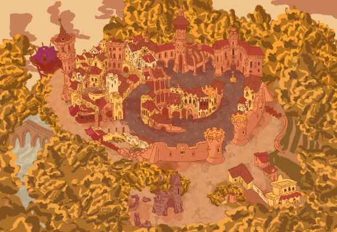

# BiblioRescat | GDD
### _Game Design Document_

## 1. Especificacions
- Plataforma: PC
- Públic objectiu: Tots els públics
- Classificació per edats objectiva: PEGI +3
- Gènere: Aventura, Top-down 
- Motor: Unity

## 2. Sinopsi
_Els llibres de les biblioteques s'han perdut!_

_Explora cada plaça, parla amb els seus habitants i troba tots els llibres per rescatar les biblioteques!_

## 3. Càmera
#### Càmera en vista d'ocell _(top-down)_
- En un inici sense suavitzat de moviment.
- La posició del personatge jugador és el centre de la càmera.
- El zoom de la càmera és fixe.

## 4. Identitat visual
Els personatges són capgrossos i dibuixats en estil de dibuixos animats, amb ombres dures i colors vius.
Els escenaris segueixen el mateix estil. Reprodueixen edificis reals però en redueixen els detalls i l'escala.

Exemples de referència:

## 5. Mecàniques i controls
- Moviment del personatge amb el teclat.
- Comptador de llibres a trobar.
- Habitants que es mouen i parlen amb el personatge.
- Senyal que indica els llibres restants a trobar i porta a la següent biblioteca.
- Efectes especials: pluja, vent, boira, nit, confetis.
- Música i sons ambientals.

El personatge es controla amb les fletxes direccionals del teclat i les tecles `W`, `A`, `S` i `D`.
Quan s'apropa a elements amb qui pot interactuar, com ara habitants o llibres, 
apareix un missatge indicant quina tecla (sovint 'E') o botó prémer per a interactuar amb ells.

## 6. Interfície d'Usuari
La interfície d'usuari (UI) és senzilla:
- Menú d'inici: es mostra el títol i una imatge de fons, i a sobre un botó per a començar la partida.
  - _Nota: s'hi pot afegir un menú d'opcions per a configurar el so, la música o la resolució, però no és imprescindible al principi._
- Durant la partida:
  - Comptador de llibres a trobar.
  - Missatge d'interacció amb habitants o llibres.
  - Missatge de final de partida quan s'han trobat tots els llibres.
  - Botó de pausa per a tornar al menú d'inici o sortir del joc.

## 7. Nivells
- Cada nivell és una plaça amb una biblioteca. L'ordre dels nivells és aleatori, però des del codi es pot indicar quina biblioteca va la primera.
- Les biblioteques previstes a afegir són les següents:
  1. Biblioteca Manuel Serra i Moret (Pineda de Mar)
  2. Biblioteca Pompeu Fabra (Mataró)
  3. Pare Gual i Pujadas (Canet de Mar)
  4. Biblioteca Popular (Mataró)
  5. Biblioteca Pare Fidel Fita (Arenys de Mar)
  6. Biblioteca Antoni Comas (Mataró)

_Nota: els GDD poden tenir més o menys apartats i ser més o menys llargs en funció del videojoc._ 
_Cadascú hi afegeix els apartats que necessita._

_S'acostumen a començar fent més curts, anomentats "Game Proposal" o "Game Concept", i es van ampliant a mesura que el joc es va desenvolupant._